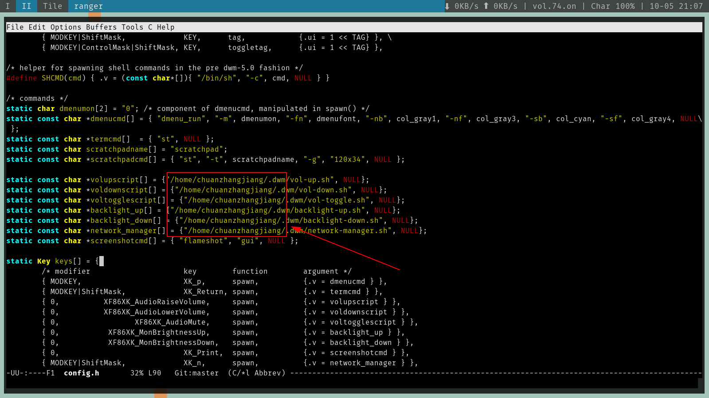

#! https://zhuanlan.zhihu.com/p/262067759
# Ubuntu DWM安装配置文档

- [前言](#前言)
- [关于DWM](#关于dwm)
- [准备工作](#准备工作)
  - [基础依赖](#基础依赖)
  - [后期功能性软件](#后期功能性软件)
- [DWM安装](#dwm安装)
- [设置DWM启动方式](#设置dwm启动方式)
  - [使用display manager启动](#使用display-manager启动)
  - [使用startx命令从文字界面启动(推荐)](#使用startx命令从文字界面启动推荐)
## 前言
本教程直接使用本人配置好的DWM，建议新手直接使用我的配置，等上手之后在在行下载官方源码进行编译安装配置。
## 关于DWM
可以看B站CW大佬的[视频](https://www.bilibili.com/video/BV11J411t7RY)
## 准备工作
### 基础依赖
```
$ sudo apt-get install suckless-tools libx11-dev libxft-dev libxinerama-dev gcc make
```
### 后期功能性软件
透明配置支持
```
$ sudo apt install compton

或者用下面的工具

$ sudo apt install xcompmgr
```

背景图片设置工具
```
$ sudo apt install feh
```
电源监控工具
```
$ sudo apt install acpi acpitool
```
背光灯调整工具
```
$ sudo apt install light
```
为背光灯调整工具设置sudo免密码
```
$ sudo visudo
```
然后在文本最后加入如下代码
```
{登录系统的用户名} ALL=NOPASSWD:/usr/bin/light
```
安装截图工具
```
$ sudo apt install flameshot
```
虚拟机可能需要以下软件

virtualbox
```
$ sudo apt-get install virtualbox-guest-utils virtualbox-guest-X11
```
vmware
```
$ sudo apt-get install open-vm-tools open-vm-desktop
```
## DWM安装

获取源码
```
$ git clone https://github.com/chuanzhangjiang/dwm.git
```
移动到源码目录修改config.h文件，自行修改下图中用户目录名称



获取dwm自定义脚本
```
$ git clone https://github.com/chuanzhangjiang/dwm-script.git
```
将所有脚本放入`～/.dwm`目录，如果没有此目录请自行创建
```
$ ~/脚本/目录$ cp * ~/.dwm
```
移动到dwm源码目录执行安装命令
```
$ sudo make clean install
```
## 设置DWM启动方式
有两种启动方式可以选择
### 使用display manager启动
以ubuntu 20.04为例,ubuntu 20.04使用gdm3做为display manager，配置完成之后可以在登录界面选择dwm作为桌面启动，如下图：

具体配置方式，进入`/usr/share/xsessions/`目录，新建文件`dwm.desktop`,输入内容：
```
[Desktop Entry]
Encoding=UTF-8
Name=Dwm
Comment=Dynamic window manager
Exec=dwm
Icon=dwm
Type=XSession
```
### 使用startx命令从文字界面启动(推荐)
此方式开机更加快速，使用更加灵活，系统资源占用更少。

**首先将系统改为默认进入文字界面**


修改grub配置,打开文件`/etc/default/grub`,将`GRUB_CMDLINE_LINUX_DEFAULT="quiet splash"`的改为`GRUB_CMDLINE_LINUX_DEFAULT="text"`然后执行命令
```
$ sudo update-grub
```
将启动等级改为多用户等级，执行如下命令：
```
$ systemctl set-default multi-user.target 
// 如果想改回启动图形界面执行下面
$ systemctl set-default graphical.target
```
最后修改`~/.xsession`文件（如果没有就新建），在最后一行加入
```
exec dwm
```
重启电脑，执行startx命令，直接进入dwm，同时也可以执行`sudo systemctl start gdm.service`命令，打开gdm3的用户登录界面。

完。