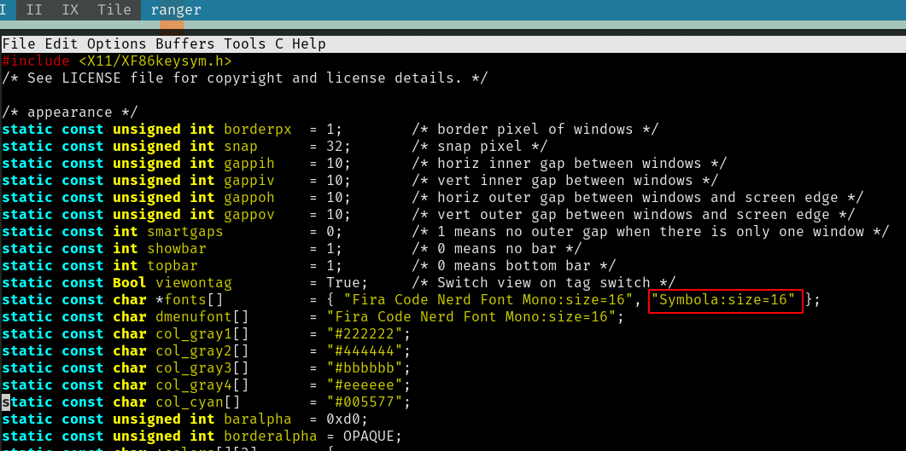
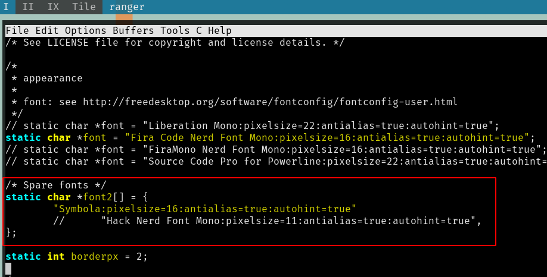

#! https://zhuanlan.zhihu.com/p/266646958
# dwm和st无法显示emoji

- [问题说明](#问题说明)
- [安装emoji支持字体](#安装emoji支持字体)
- [配置dwm](#配置dwm)
- [配置st](#配置st)
- [重新编译安装](#重新编译安装)

## 问题说明
问题是由于dwm和st以来的xft出现bug导致的，arch平台可以安装`libxft-bgra`补丁来修复xft的bug，其他平台解决此问题不太容易，只能等libxft更新。
本文基于ubuntu 20.04,采用迂回战术解决此问题。
## 安装emoji支持字体
```
sudo apt install fonts-symbola
```
## 配置dwm
修改dwm的`config.h`文件：


## 配置st
安装[font2补丁](https://st.suckless.org/patches/font2/),此处不介绍补丁安装方式。

修改`config.h`文件:


## 重新编译安装
重新编译安装dwm和st即可。