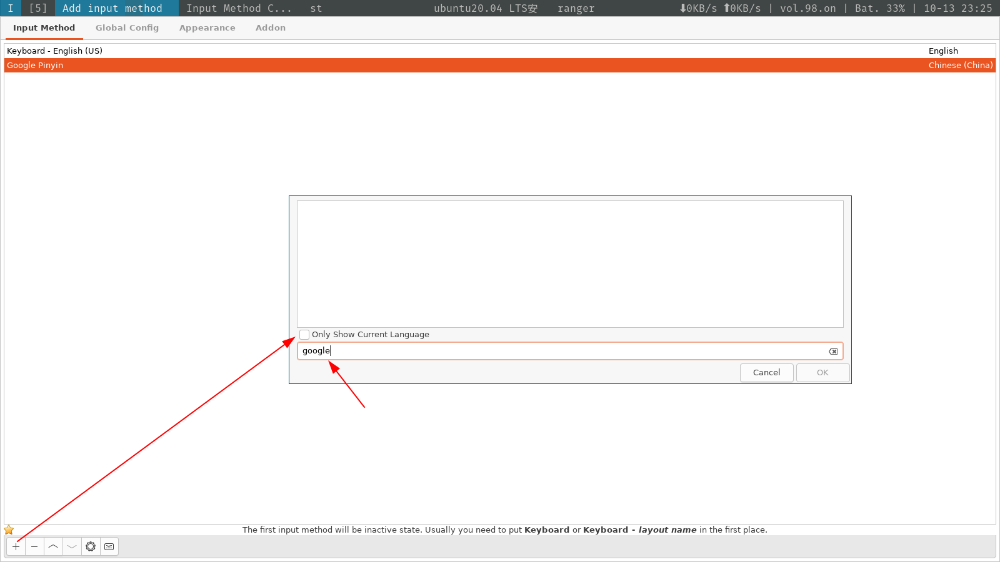
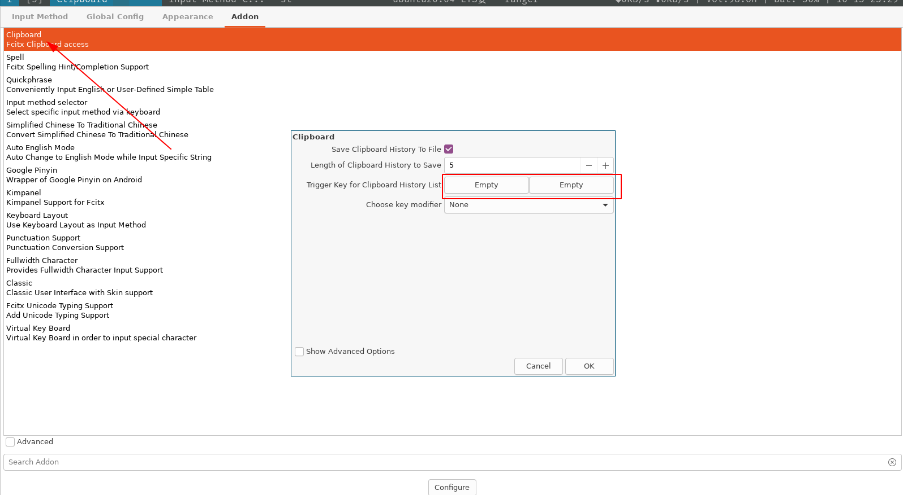

# 必备软件清单

- [deja-dup](#deja-dup)
- [vscode](#vscode)
- [chrome](#chrome)
- [docker](#docker)
- [Idea](#idea)
- [dbeaver](#dbeaver)
- [openJDK11](#openjdk11)
- [sbt](#sbt)
- [xdm下载工具](#xdm下载工具)
- [U盘烧录工具](#u盘烧录工具)
- [截图工具](#截图工具)
- [VLC播放器](#vlc播放器)
- [node环境](#node环境)
- [node安装的软件包更新命令(如vue-cli)](#node安装的软件包更新命令如vue-cli)
- [安装vue-cli](#安装vue-cli)
- [virtualbox](#virtualbox)
- [htop资源管理器](#htop资源管理器)
- [sensors cpu温度监控工具](#sensors-cpu温度监控工具)
- [emacs](#emacs)
- [输入法](#输入法)
- [atool](#atool)

软件安装前首先执行`sudo apt update`命令。

## deja-dup
备份工具，用于备份home分区的一些配置文件
```
sudo apt install deja-dup
```
## vscode
方法1
```
sudo snap install code --classic
```
方法2（推荐）
```
sudo wget -q https://packages.microsoft.com/keys/microsoft.asc -O- | sudo apt-key add - 

sudo add-apt-repository "deb [arch=amd64] https://packages.microsoft.com/repos/vscode stable main"

sudo apt update

sudo apt install code
```

## chrome
```
sudo wget http://www.linuxidc.com/files/repo/google-chrome.list -P /etc/apt/sources.list.d/

wget -q -O - https://dl.google.com/linux/linux_signing_key.pub | sudo apt-key add -

sudo apt-get update

sudo apt-get install google-chrome-stable
```

## docker
```
curl -fsSL get.docker.com -o get-docker.sh

sudo sh get-docker.sh --mirror Aliyun
```

## Idea
```
sudo snap install intellij-idea-community --classic
```

## dbeaver
数据库管理客户端
```
sudo snap install dbeaver-ce --classic
```

## openJDK11
```
sudo apt install openjdk-11-jdk

sudo apt install openjdk-11-source
```

## sbt
```
echo "deb https://dl.bintray.com/sbt/debian /" | sudo tee -a /etc/apt/sources.list.d/sbt.list

curl -sL "https://keyserver.ubuntu.com/pks/lookup?op=get&search=0x2EE0EA64E40A89B84B2DF73499E82A75642AC823" | sudo apt-key add

sudo apt update

sudo apt-get install sbt
```

## xdm下载工具
```
sudo chmod u+x xdm-install.sh

./xdm-install.sh
```

## U盘烧录工具
```
sudo apt install usb-creator-gtk
```

## 截图工具
```
sudo apt install flameshot
```

## VLC播放器
```
sudo snap install vlc
```

## node环境
```
curl -sL https://deb.nodesource.com/setup_14.x | sudo -E bash

sudo apt install -y nodejs
```
## node安装的软件包更新命令(如vue-cli)
```
sudo npm update -g [可更上特定包名，不加就更新所有]
```
## 安装vue-cli
```
sudo npm install -g @vue/cli
```

## virtualbox
```
wget -q https://www.virtualbox.org/download/oracle_vbox_2016.asc -O- | sudo apt-key add - 

sudo add-apt-repository "deb [arch=amd64] http://download.virtualbox.org/virtualbox/debian $(lsb_release -cs) contrib"

sudo apt update

sudo apt instal virtualbox-6.1 #年代久远可以尝试输入virtualbox- 然后tab查看最新版本
```

## htop资源管理器
```
sudo apt install htop
```

## sensors cpu温度监控工具
```
sudo apt install lm-sensors
``` 

## emacs 
```
sudo apt install emacs
```
## 输入法
安装fcitx输入框架
```
sudo apt install fcitx
```
将默认输入框架设置为fcitx
```
im-config # 确定 -》选择fcitx
```
安装google拼音输入法
```
sudo apt install fcitx-googlepinyin -y
```
配置google拼音输入法
```
fcitx-config-gtk3
```



## atool
ranger文件解压缩支持工具
```
sudo apt install atool
```