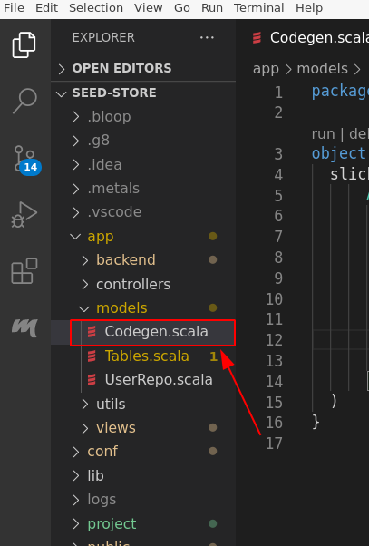

#! https://zhuanlan.zhihu.com/p/265746455
# scala使用playframwork开发webApp系列壹——项目搭建
- [系列目录](#系列目录)
- [新建play项目](#新建play项目)
- [运行项目](#运行项目)
- [配置依赖](#配置依赖)
- [配置数据库(mysql)](#配置数据库mysql)
  - [使用数据库自动演进（evolutions）](#使用数据库自动演进evolutions)
  - [使用`slick codegen`自动生成数据库操作代码](#使用slick-codegen自动生成数据库操作代码)

## 系列目录
[**scala使用playframwork开发webApp系列壹——项目搭建**](https://zhuanlan.zhihu.com/p/265746455)

[scala使用playframwork开发webApp系列二——slick使用](https://zhuanlan.zhihu.com/p/286630566)

[scala使用playframwork开发webApp系列三——CSRF过滤器配置](https://zhuanlan.zhihu.com/p/301350500)

## 新建play项目
```
sbt new playframework/play-scala-seed.g8
```
## 运行项目
terminal中运行
```
sbt run
```
vscode中运行
launch.json文件
```
{
    // Use IntelliSense to learn about possible attributes.
    // Hover to view descriptions of existing attributes.
    // For more information, visit: https://go.microsoft.com/fwlink/?linkid=830387
    "version": "0.2.0",
    "configurations": [
        {
            "type": "scala",
            "request": "launch",
            "name": "Play main",
            "mainClass": "play.core.server.ProdServerStart",
            "args": [],
            "jvmOptions": []
        }
    ]
}
```
application.conf文件添加screatkey
```
play.http.secret.key=${?PLAY_SECREAT_KEY}
```
~/.bashrc中添加环境变量(如果使用zsh则添加在~/.zshrc中):
```
export PLAY_SECREAT_KEY='QCY?tAnfk?aZ?iwrNwnxIlR6CTf:G3gf:90Latabg@5241AB`R5W:1uDFN];Ik@n'
```
刷新.bashrc文件.(关闭所有vscode界面和terminal界面)
```
source .bashrc
```
## 配置依赖
在build.sbt中添加如下依赖
```
libraryDependencies ++= Seq(
  "com.typesafe.play" %% "play-slick" % "5.0.0",
  "com.typesafe.play" %% "play-slick-evolutions" % "5.0.0",
  "com.typesafe.slick" %% "slick-codegen" % "3.3.3",
  "mysql" % "mysql-connector-java" % "5.1.41",
  "org.mindrot" % "jbcrypt" % "0.4"
)
```
## 配置数据库(mysql)
在application.conf中添加配置(db.url自行替换):
```
# Default database configuration
slick.dbs.default.profile="slick.jdbc.MySQLProfile$"
slick.dbs.default.db.driver="com.mysql.jdbc.Driver"
slick.dbs.default.db.url="jdbc:mysql://192.168.1.249:3306/seed-store?useSSL=false&characterEncoding=UTF-8"
slick.dbs.default.db.user=${?MYSQL_USER}
slick.dbs.default.db.password=${?MYSQL_PSD}
```
~/.bashrc中添加环境变量:
```
export MYSQL_USER='{用户名}'
export MYSQL_PSD='{密码}'
```
刷新.bashrc文件.(关闭所有vscode界面和terminal界面)
```
source ~/.bashrc
```
配置项目中的logback.xml文件，在`<root>`节点之前添加以下语句使其能在控制台中显示SQL语句:
```
<logger name="slick.jdbc.JdbcBackend.statement"  level="DEBUG" /> 
```
### 使用数据库自动演进（evolutions）
1.创建如下目录，其中default表示数据库名称（图中为默认数据库）,创建sql文件以1,2,3命名，表示时间先后顺序。


2.sql文件样例：

样例1：
```
-- !Ups

DROP TABLE IF EXISTS `user`;
CREATE TABLE `user` (
    `id` INT AUTO_INCREMENT,
    `username` VARCHAR(50) NOT NULL unique,
    `password` VARCHAR(50),
    `phone_number` VARCHAR(50),
    PRIMARY KEY (`id`)
)ENGINE InnoDB DEFAULT CHARSET=UTF8;

-- !Downs

DROP TABLE `user`;
```
样例2：
```
-- !Ups

ALTER TABLE `product` ADD CONSTRAINT `prdct_foreign_key_prdct` FOREIGN KEY(`manufacturer_id`)
REFERENCES `manufacturer`(`id`);

-- !Downs

ALTER TABLE `product` DROP FOREIGN KEY `prdct_foreign_key_prdct`;
```
样例3：
```
-- !Ups
CREATE TABLE operator (
	`id` INT AUTO_INCREMENT,
    `username` VARCHAR(50) NOT NULL unique,
    `password` VARCHAR(100) NOT NULL,
     PRIMARY KEY (`id`)
)ENGINE InnoDB DEFAULT CHARSET=UTF8;

INSERT INTO operator(username, password)
VALUES('admin', '$2a$10$D.DPASo7cAvdU9b0URPbY.www8lLK6PkJPQUT/TlWO.S84CYslzZO');

-- !Downs

DELETE FROM operator where username = 'admin';

DROP TABLE operator;
```
写好sql之后运行一次项目，然后打开项目网页，会提示运行脚本，运行即可。
### 使用`slick codegen`自动生成数据库操作代码
方法一、在项目中创建一个main方法，每次数据库修改手动运行此main方法：

在项目源码目录新建scala文件,如下图:



`Codegen.scala`文件内容样例如下:
```
import java.io.File
object CodeGen extends App {
  val dbHost = "localhost:3306"
  // val dbHost = "192.168.1.249:3306"
  val dbName = "manager-sys-demo"
  val dbUserName = System.getenv("MYSQL_USER")
  val dbPass = System.getenv("MYSQL_PSD")
  val sourceCodeDir = new File("").getAbsolutePath() + File.separator + "app"
  slick.codegen.SourceCodeGenerator.main(
    Array(
      "slick.jdbc.MySQLProfile",
      "com.mysql.jdbc.Driver",
      s"jdbc:mysql://${dbHost}/${dbName}?useSSL=false&characterEncoding=UTF-8",
      sourceCodeDir,
      "models",
      dbUserName,
      dbPass
    )
  )
}
```
`/home/chuanzhangjiang/scala_project/seed-store/app/`源码目录,`models`为源码输出的包，使用里面的`Tables`对象即可。
每次数据库有修改，手动运行`Codegen.scala`即可。
方法二、配置sbt脚本，项目每次编译自动生成`Tables`对象:
修改`project`目录下的`plugins.sbt`文件,添加如下内容：
```
addSbtPlugin("com.github.tototoshi" % "sbt-slick-codegen" % "1.4.0")

//根据你所使用的数据库而定
libraryDependencies += "mysql" % "mysql-connector-java" % "5.1.41"
```

修改`build.sbt`,添加如下内容:
```
import slick.codegen.SourceCodeGenerator
import slick.{model => m}

val hosetName = "//localhost:3306"
val dbName = "manager-sys-demo"

// required
slickCodegenSettings

// required
// Register codegen hook
sourceGenerators in Compile += slickCodegen.taskValue

// required 配置数据库url
slickCodegenDatabaseUrl := s"jdbc:mysql:${hosetName}/${dbName}?useSSL=false&characterEncoding=UTF-8"

// required 从环境变量中获取登录数据库的用户名
slickCodegenDatabaseUser := System.getenv("MYSQL_USER")

// required 从环境变量中获取数据库密码
slickCodegenDatabasePassword := System.getenv("MYSQL_PSD")

// required slickCodegen数据库驱动,非字符串
slickCodegenDriver := slick.jdbc.MySQLProfile

// required jdbc驱动,字符串
slickCodegenJdbcDriver := "com.mysql.jdbc.Driver"

// optional but maybe you want `Tables`对象的包名
slickCodegenOutputPackage := "models"

//optional Tables.scala输出目录
// slickCodegenOutputDir := (sourceManaged in Compile).value

// optional 忽略指定表
// For example, to exclude play evolutions play_evolutions table from the target of codegen. This still applies after slickCodegenIncludedTables.
slickCodegenExcludedTables := Seq("play_evolutions")
```

完成以上配置，sbt将在你每次编译项目的时候自动生产`Tables`对象。

附上`slick-codegen`sbt插件项目[地址](https://github.com/tototoshi/sbt-slick-codegen)。